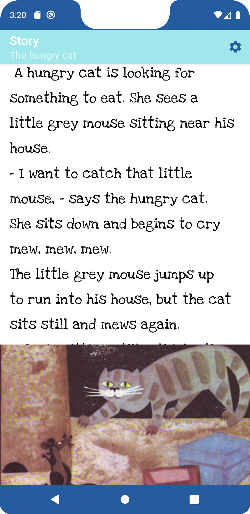

# Kids Stories




### Content
- Main Activity
- Story Activity
- Settings Activity

---

### Main Activity
- activity_main.xml
- item_animal.xml
- AnimalListAdapter.kt
- MainActivity.kt

#### activity_main.xml
```
<androidx.recyclerview.widget.RecyclerView
    xmlns:android="http://schemas.android.com/apk/res/android"
    xmlns:app="http://schemas.android.com/apk/res-auto"
    xmlns:tools="http://schemas.android.com/tools"
    android:id="@+id/animal_rv"
    android:layout_width="match_parent"
    android:layout_height="match_parent"
    android:paddingHorizontal="16dp"
    android:paddingTop="16dp"
    app:layoutManager="androidx.recyclerview.widget.LinearLayoutManager"
    tools:context=".MainActivity"
    tools:listitem="@layout/item_animal">

</androidx.recyclerview.widget.RecyclerView>
```
#### item_animal.xml
```
<com.google.android.material.card.MaterialCardView
    xmlns:android="http://schemas.android.com/apk/res/android"
    xmlns:app="http://schemas.android.com/apk/res-auto"
    xmlns:tools="http://schemas.android.com/tools"
    android:layout_width="match_parent"
    android:layout_height="wrap_content"
    android:layout_marginVertical="8dp"
    android:padding="16dp"
    app:cardCornerRadius="40dp">

    <ImageView
        android:id="@+id/bg_item"
        android:layout_width="match_parent"
        android:layout_height="120dp"
        app:tint="#AB000000"
        android:tintMode="src_atop"
        android:scaleType="centerCrop"
        tools:src="@drawable/bee"
        android:contentDescription="@string/story_icon_background" />

    <TextView
        android:id="@+id/title_tv"
        android:layout_width="match_parent"
        android:layout_height="match_parent"
        android:fontFamily="@font/cutive_mono"
        android:gravity="center"
        android:shadowColor="@color/black"
        android:shadowDx="2"
        android:padding="8dp"
        android:shadowDy="2"
        android:shadowRadius="3"
        android:textColor="@color/cyan"
        android:textSize="28sp"
        android:textStyle="bold"
        tools:text="@string/bee_title" />

</com.google.android.material.card.MaterialCardView>
```
#### AnimalListAdapter.kt
```
typealias ClickHandler = (position: Int) -> Unit

class AnimalListAdapter(
    private val animalList: ArrayList<Animal>,
    private val listener: ClickHandler = {}
) : RecyclerView.Adapter<AnimalListAdapter.VH>() {

    class VH(
        binding: ItemAnimalBinding,
        listener: ClickHandler /* = (position: Int) -> Unit */
    ) : RecyclerView.ViewHolder(binding.root) {

        val titleItemText = binding.titleTv
        val bgItemImage = binding.bgItem

        init {
            binding.root.setOnClickListener {
                listener(adapterPosition)
            }
        }
    }

    override fun onCreateViewHolder(parent: ViewGroup, viewType: Int) = VH(
        ItemAnimalBinding.inflate(
            LayoutInflater.from(parent.context),
            parent,
            false
        ), listener
    )

    override fun onBindViewHolder(holder: VH, position: Int) {
        holder.titleItemText.text = animalList[position].title
        holder.bgItemImage.setImageResource(animalList[position].picture)
    }

    override fun getItemCount() = animalList.size
}
```
#### MainActivity.kt
```
class MainActivity : AppCompatActivity() {
    private val OBJECT_NAME = "com.example.kidsstories.ANIMAL"
    private lateinit var binding: ActivityMainBinding

    override fun onCreate(savedInstanceState: Bundle?) {
        super.onCreate(savedInstanceState)
        binding = ActivityMainBinding.inflate(layoutInflater)
        setContentView(binding.root)
        title = getString(R.string.main_name)
        val animals = arrayListOf(
            Animal(
                getString(R.string.bee_title),
                R.raw.bee,
                R.drawable.bee,
                R.string.bee_story
            ),
            Animal(
                getString(R.string.chicken_title),
                R.raw.chicken,
                R.drawable.chicken,
                R.string.chicken_story
            ),
            Animal(
                getString(R.string.cat_title),
                R.raw.cat,
                R.drawable.cat,
                R.string.cat_story
            ),
            Animal(
                getString(R.string.duck_title),
                R.raw.duck,
                R.drawable.duck,
                R.string.duck_story
            )
        )

        val adapter = AnimalListAdapter(animals) {
            val intent = Intent(this, StoryActivity::class.java)
            intent.putExtra(OBJECT_NAME, animals[it])
            startActivity(intent)
        }

        binding.animalRv.adapter = adapter
    }

    override fun onCreateOptionsMenu(menu: Menu?): Boolean {
        menuInflater.inflate(R.menu.menu, menu)
        return true
    }

    override fun onOptionsItemSelected(item: MenuItem): Boolean {
        // Temporary, because we have one item.
        startActivity(Intent(this, SettingsActivity::class.java))
        return super.onOptionsItemSelected(item)
    }
}
```
---
### Story Activity
- activity_story.xml
- StoryActivity.kt

#### activity_story.xml
```
<androidx.constraintlayout.widget.ConstraintLayout
    xmlns:android="http://schemas.android.com/apk/res/android"
    xmlns:app="http://schemas.android.com/apk/res-auto"
    xmlns:tools="http://schemas.android.com/tools"
    android:layout_width="match_parent"
    android:layout_height="match_parent"
    tools:context=".StoryActivity">

    <ScrollView
        android:id="@+id/story_scroll"
        android:layout_width="0dp"
        android:layout_height="0dp"
        android:paddingHorizontal="16dp"
        app:layout_constraintBottom_toTopOf="@id/story_image"
        app:layout_constraintEnd_toEndOf="parent"
        app:layout_constraintStart_toStartOf="parent"
        app:layout_constraintTop_toTopOf="parent"
        app:layout_constraintVertical_weight="2">

        <TextView
            android:id="@+id/story_text"
            android:layout_width="wrap_content"
            android:layout_height="wrap_content"
            android:fontFamily="@font/love_ya_like_a_sister"
            android:lineHeight="40dp"
            android:textColor="@color/black"
            android:textSize="24sp"
            tools:text="@string/bee_story" />

    </ScrollView>

    <ImageView
        android:id="@+id/story_image"
        android:layout_width="0dp"
        android:layout_height="0dp"
        android:scaleType="centerCrop"
        app:layout_constraintBottom_toBottomOf="parent"
        app:layout_constraintEnd_toEndOf="parent"
        app:layout_constraintStart_toStartOf="parent"
        app:layout_constraintTop_toBottomOf="@id/story_scroll"
        app:layout_constraintVertical_weight="1"
        tools:src="@drawable/bee" />

</androidx.constraintlayout.widget.ConstraintLayout>
```
#### StoryActivity.kt
```
class StoryActivity : AppCompatActivity() {
    private val OBJECT_NAME = "com.example.kidsstories.ANIMAL"
    private var _binding: ActivityStoryBinding? = null
    private val binding get() = _binding!!
    private var visibilitySwitch = false
        get() {
            field = !field
            return field
        }
    private lateinit var media: MediaPlayer
    private val SETTINGS = "settings"
    private val TEXT_SIZE = "size"
    private lateinit var textPref: SharedPreferences

    override fun onCreate(savedInstanceState: Bundle?) {
        super.onCreate(savedInstanceState)
        _binding = ActivityStoryBinding.inflate(layoutInflater)
        setContentView(binding.root)

        title = getString(R.string.story)
        val actionBar = supportActionBar

        val animal: Animal? = intent.getParcelableExtra(OBJECT_NAME)

        animal?.let {
            actionBar?.subtitle = it.title
            setViews(it)
        }

        textPref = getSharedPreferences(SETTINGS, MODE_PRIVATE)

        binding.storyImage.setOnClickListener {
            binding.storyText.visibility = if (visibilitySwitch) View.GONE else View.VISIBLE
        }

        binding.storyText.setOnClickListener {
            binding.storyImage.visibility = if (visibilitySwitch) View.GONE else View.VISIBLE
        }
    }

    private fun setViews(animal: Animal) {
        binding.storyText.text = getString(animal.story)
        binding.storyImage.setImageResource(animal.picture)
        media = MediaPlayer.create(this, animal.sound)
        media.start()
    }

    override fun onCreateOptionsMenu(menu: Menu?): Boolean {
        menuInflater.inflate(R.menu.menu, menu)
        return super.onCreateOptionsMenu(menu)
    }

    override fun onOptionsItemSelected(item: MenuItem): Boolean {
        startActivity(Intent(this, SettingsActivity::class.java))
        return super.onOptionsItemSelected(item)
    }

    override fun onStart() {
        super.onStart()
        val textSize = textPref.getFloat(TEXT_SIZE, 24F)
        binding.storyText.textSize = textSize
    }

    override fun onPause() {
        super.onPause()
        if (this::media.isInitialized)
            media.release()
    }

    override fun onDestroy() {
        super.onDestroy()
        _binding = null
    }
}
```
---
### Settings Activity
- activity_settings.xml
- SettingsActivity.kt
- SettingsViewModel.kt

#### activity_settings.xml
```
<FrameLayout
    xmlns:android="http://schemas.android.com/apk/res/android"
    xmlns:app="http://schemas.android.com/apk/res-auto"
    xmlns:tools="http://schemas.android.com/tools"
    android:layout_width="match_parent"
    android:layout_height="match_parent"
    tools:context=".SettingsActivity">

    <RadioGroup
        android:id="@+id/text_size_radiogroup"
        android:layout_width="wrap_content"
        android:layout_height="wrap_content"
        android:layout_gravity="center"
        android:checkedButton="@id/medium_rb">

        <RadioButton
            android:id="@+id/small_rb"
            style="@style/radio_button"
            android:layout_width="match_parent"
            android:layout_height="wrap_content"
            android:text="Small Text" />

        <RadioButton
            android:id="@+id/medium_rb"
            style="@style/radio_button"
            android:layout_width="wrap_content"
            android:layout_height="wrap_content"
            android:text="Medium Text" />

        <RadioButton
            android:id="@+id/large_rb"
            style="@style/radio_button"
            android:layout_width="match_parent"
            android:layout_height="wrap_content"
            android:text="Large Text" />
    </RadioGroup>

</FrameLayout>
```
#### SettingsActivity.kt
```
class SettingsActivity : AppCompatActivity() {

    private val SETTINGS = "settings"
    private val TEXT_SIZE = "size"
    private lateinit var binding: ActivitySettingsBinding
    override fun onCreate(savedInstanceState: Bundle?) {
        super.onCreate(savedInstanceState)
        binding = ActivitySettingsBinding.inflate(layoutInflater)
        setContentView(binding.root)
        title = getString(R.string.settings)

        val viewModel = ViewModelProvider(this).get(SettingsViewModel::class.java)

        val radioGroup = binding.textSizeRadiogroup
        val pref = getSharedPreferences(SETTINGS, MODE_PRIVATE)

        when (pref.getFloat(TEXT_SIZE, 24F)) {
            20F -> radioGroup.check(R.id.small_rb)
            28F -> radioGroup.check(R.id.large_rb)
        }

        viewModel.textSize.observe(this) {
            binding.smallRb.textSize = it
            binding.mediumRb.textSize = it
            binding.largeRb.textSize = it
        }

        radioGroup.setOnCheckedChangeListener { _, checkedId ->
            when (checkedId) {
                R.id.small_rb -> viewModel.textSize.value = 20F
                R.id.medium_rb -> viewModel.textSize.value = 24F
                R.id.large_rb -> viewModel.textSize.value = 28F
            }
        }
    }

    private fun saveTextSize(size: Float) {
        val prefEdit = getSharedPreferences(SETTINGS, MODE_PRIVATE).edit()
        prefEdit.putFloat(TEXT_SIZE, size)
        prefEdit.apply()
    }

    override fun onPause() {
        super.onPause()
        saveTextSize(
            when (binding.textSizeRadiogroup.checkedRadioButtonId) {
                R.id.small_rb -> 20F
                R.id.large_rb -> 28F
                else -> 24F
            }
        )
    }
}
```
#### SettingsViewModel.kt
```
class SettingsViewModel:ViewModel() {
    var textSize = MutableLiveData<Float>()
}
```
---
### Animal Class
```
data class Animal(
    val title: String,
    @RawRes val sound: Int,
    @DrawableRes val picture: Int,
    @StringRes val story: Int
) : Parcelable {
    constructor(parcel: Parcel) : this(
        parcel.readString()?:"",
        parcel.readInt(),
        parcel.readInt(),
        parcel.readInt()
    )

    override fun writeToParcel(parcel: Parcel, flags: Int) {
        parcel.writeString(title)
        parcel.writeInt(sound)
        parcel.writeInt(picture)
        parcel.writeInt(story)
    }

    override fun describeContents(): Int {
        return 0
    }

    companion object CREATOR : Parcelable.Creator<Animal> {
        override fun createFromParcel(parcel: Parcel): Animal {
            return Animal(parcel)
        }

        override fun newArray(size: Int): Array<Animal?> {
            return arrayOfNulls(size)
        }
    }
}
```
